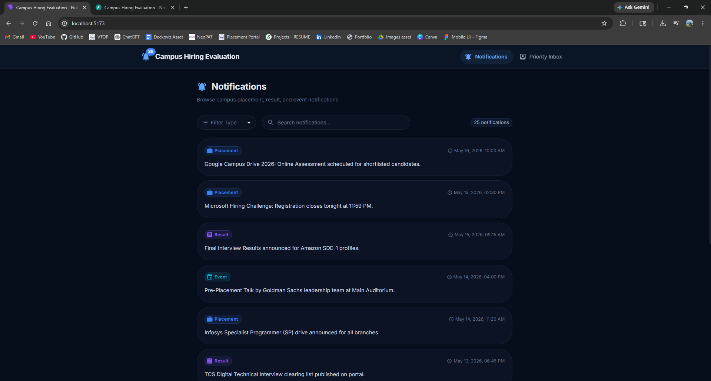
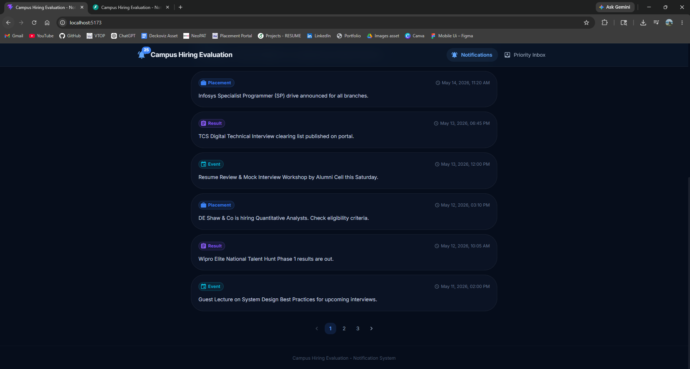
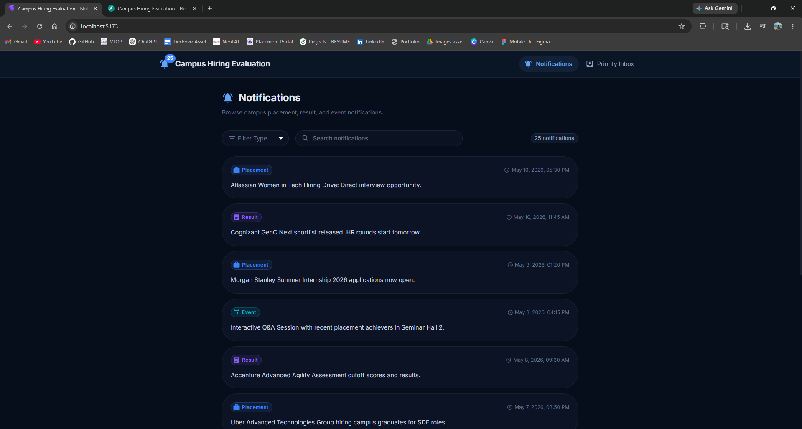
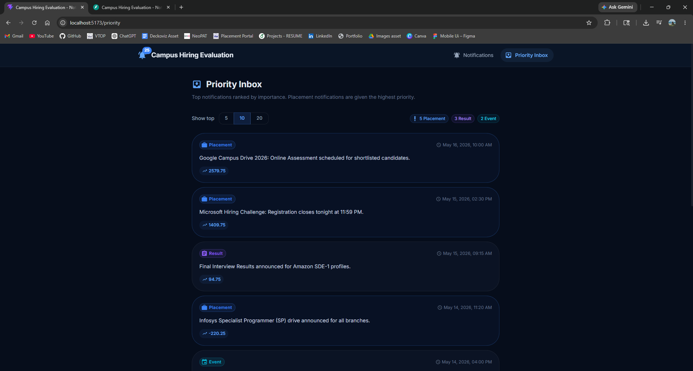
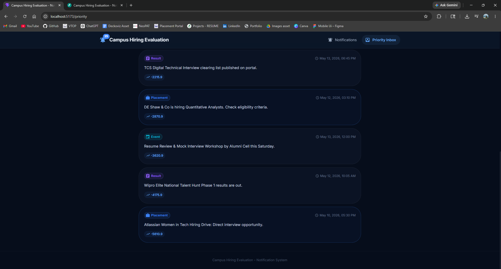
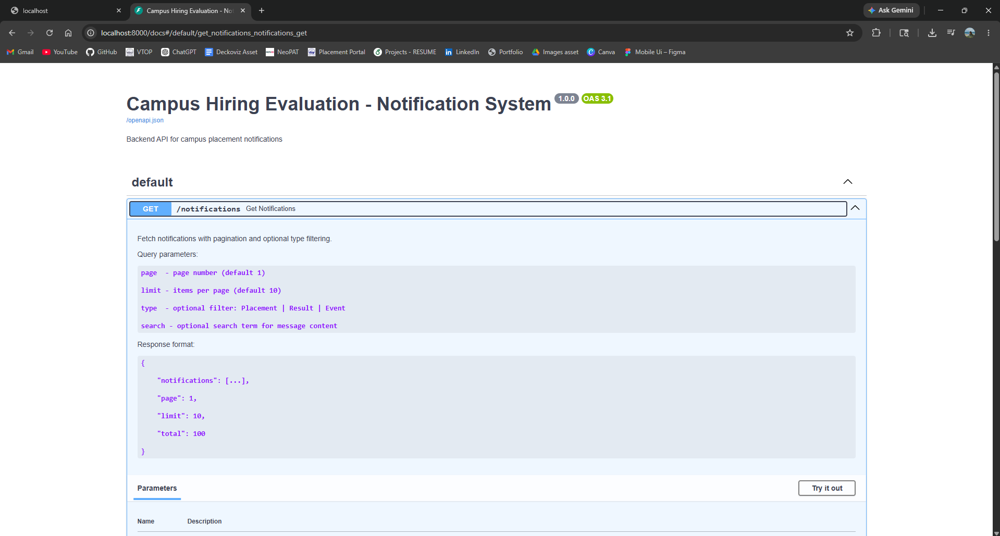
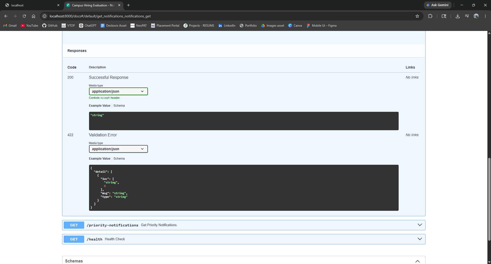
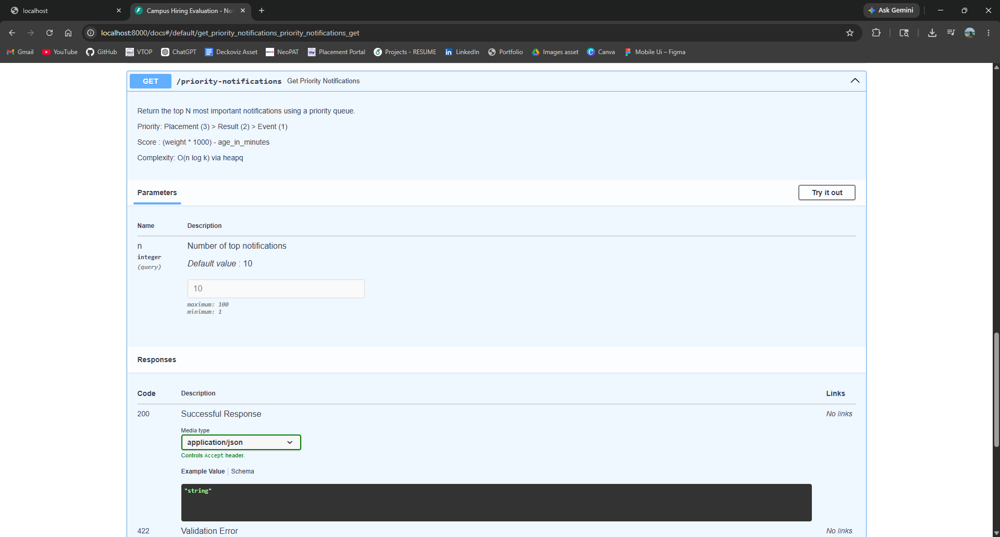
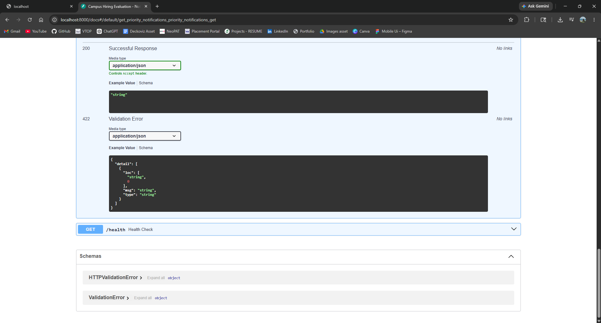
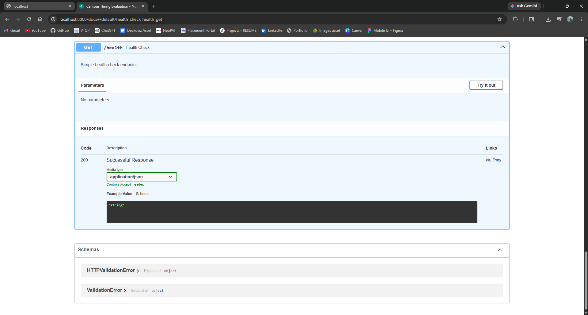

# Campus Hiring Evaluation - Full Stack Track

A full-stack campus notification system built with React and FastAPI.
Displays placement, result, and event notifications with filtering and pagination.
Features a heap-based priority inbox and request logging middleware.
Clean dark navy Material UI dashboard with a production-ready design.

---

# Postman Logger ID

{
    "logID": "4c6b1f5c-416a-4c5b-afaa-fd26b628e9d9",
    "message": "log created successfully"
}


## Tech Stack

| Layer    | Technology                        |
|----------|-----------------------------------|
| Frontend | React (Vite), Material UI, Axios  |
| Backend  | FastAPI, Python, httpx, Uvicorn   |

---

## Project Structure

```
Campus-Hiring-Evaluation/
├── backend/
│   ├── main.py          # API endpoints
│   ├── priority.py      # Heap-based priority queue
│   ├── logger.py        # Logging middleware
│   └── requirements.txt
├── frontend/
│   └── src/
│       ├── pages/       # Notifications, PriorityInbox
│       ├── components/  # Navbar, Cards, FilterBar
│       └── services/    # Axios API calls
└── README.md
```

---

## Getting Started

### Backend

```bash
cd backend
pip install -r requirements.txt
uvicorn main:app --reload
```

Runs at `http://localhost:8000`

### Frontend

```bash
cd frontend
npm install
npm run dev
```

Runs at `http://localhost:5173`

---

## API Endpoints

| Method | Endpoint                  | Description                        |
|--------|---------------------------|------------------------------------|
| GET    | `/notifications`          | Fetch notifications (filter, page) |
| GET    | `/priority-notifications` | Top-N priority notifications       |
| GET    | `/health`                 | Health check                       |

---

## App Screenshots

### Notifications Dashboard




### Priority Inbox



### API Docs (localhost:8000/docs)






---

## Features

- Placement, Result, and Event notifications
- Filter by type and search by keyword
- Pagination support
- Priority inbox using `heapq` (O(n log k))
- Request logging middleware (method, path, status, time)
- Fallback mock data if external API is unavailable
